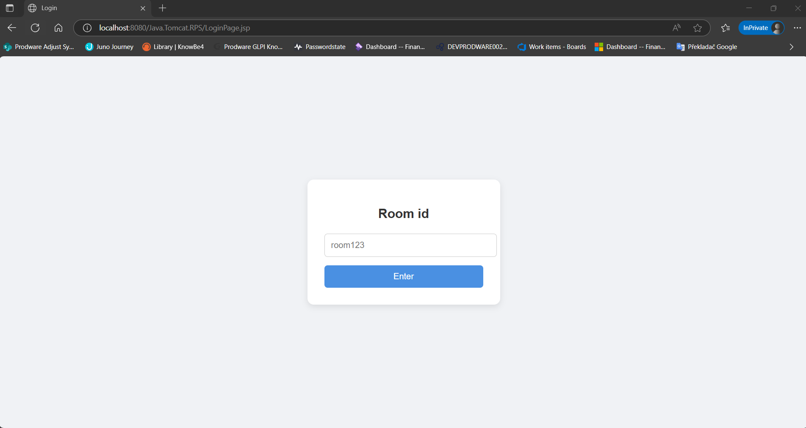
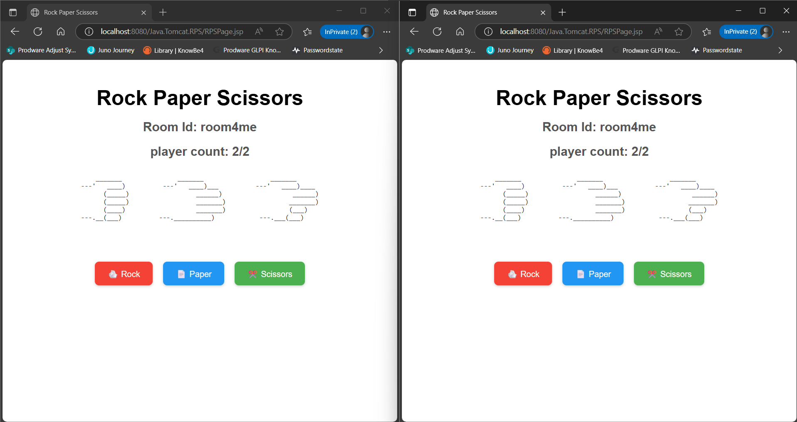
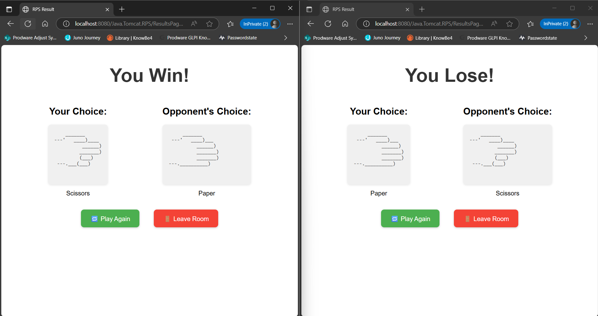

# RockPaperScissors

A simple implementation of the classic Rock Paper Scissors game.

## Features
- Lightweight
- Multiple players on one browser
- Player matchup by rooms

## Demo

## Getting Started

### Prerequisites

- Java EE
- Tomcat 10+

### Usage

Follow on-screen prompts to:
- Select Rock, Paper, or Scissors
- See results instantly
- Replay or quit the game

## Contributing

Pull requests are welcome! For major changes, please open an issue first to discuss your ideas.

## Author

- [@Electro-Lite](https://github.com/Electro-Lite)
